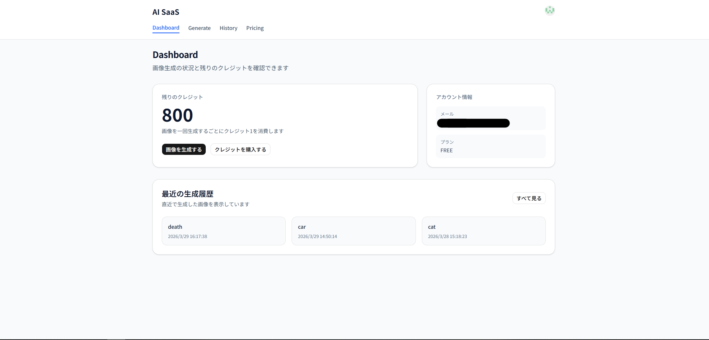
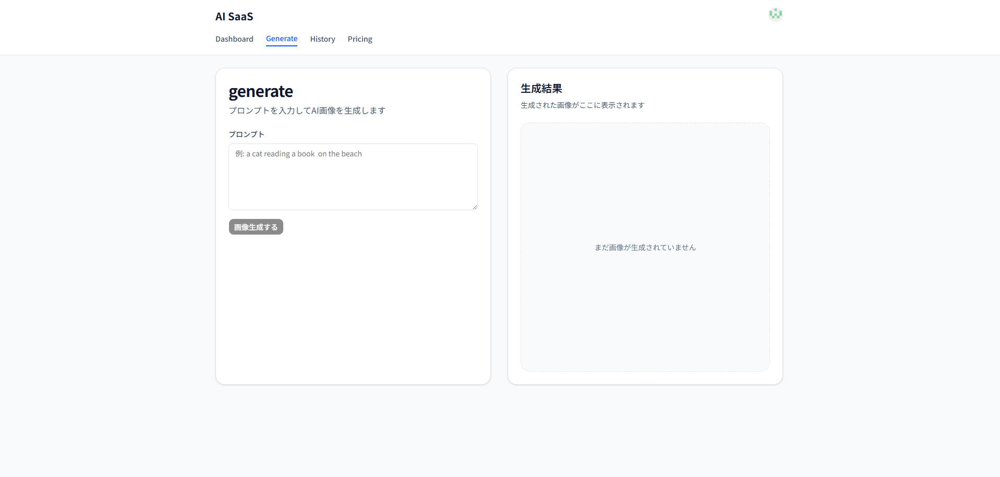
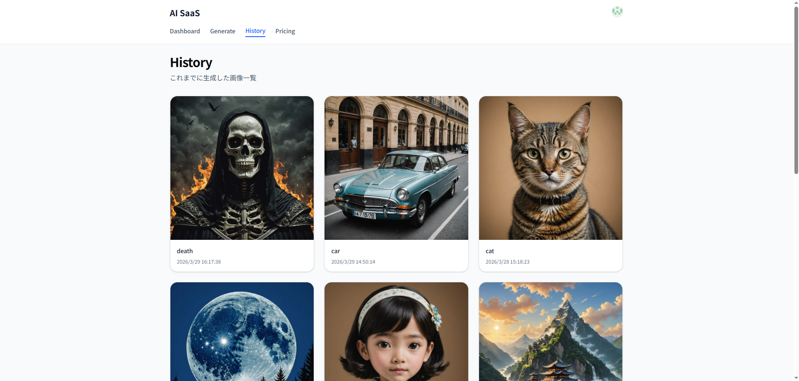

# AI Image Generator SaaS

テキスト（プロンプト）からAI画像を生成できるSaaS型Webアプリです。  
クレジット制・認証・決済まで実装しています。

## 🎯 作成目的

AIを活用したサービス開発の理解を深めるために作成しました。

---

## 🚀 デモ

👉 https://ai-saas-eight-sooty.vercel.app/

## 📸 スクリーンショット

### Dashboard



### Generate



### History



---

## 📸 機能

- ✨ AI画像生成（Stability AI）
- 🧠 プロンプト入力による画像生成
- 🕘 生成履歴の保存・表示
- 💳 クレジット制（Stripe決済）
- 🔐 認証（Clerk）
- 📥 画像ダウンロード
- 🖼 モーダルで画像拡大表示

---

## 🛠 使用技術

### フロントエンド

- Next.js (App Router)
- TypeScript
- Tailwind CSS
- shadcn/ui

### バックエンド

- Next.js API Routes
- Prisma
- PostgreSQL (Supabase)

### 認証・決済

- Clerk（認証）
- Stripe（決済）

### その他

- Stability AI API（画像生成）
- Vercel（デプロイ）

---

## ⚙️ 環境構築

### 1. リポジトリをクローン

```bash
git clone https://github.com/nozojj/ai-saas.git
cd ai-saas
```
